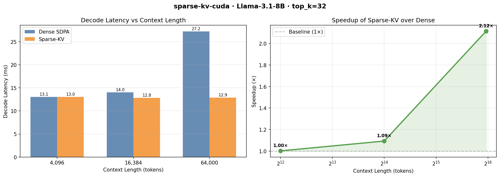

# sparse-kv-cuda

**Sparse + quantized KV cache with fused CUDA eviction kernels — making 64K–128K context practical on a single GPU.**


Standard multi-head attention stores a KV cache that grows as O(n·d) per layer.
At 128K tokens on a 7B-class model that is tens of gigabytes for the cache alone,
and the decode step becomes entirely memory-bandwidth-bound.
`sparse-kv-cuda` attacks that bottleneck with three interlocking components:
a top-k sparse attention CUDA kernel, a fused INT8/FP8 KV eviction-and-quantization
kernel, and a JAX/Pallas reference path for cross-framework verification.

---

## Skills Demonstrated

| Domain | Technologies |
|--------|-------------|
| **CUDA / GPU Programming** | Custom CUDA kernels (`.cu`), warp-level primitives, shared memory tiling, NVTX ranges, Nsight Systems / Nsight Compute profiling |
| **Systems ML** | KV cache eviction, sparse top-k attention, INT8/FP8 quantization, GQA decode, fused kernels |
| **Distributed Training** | PyTorch FSDP (`ModuleWrapPolicy`), gradient checkpointing, NCCL all-reduce overlap, H200 NVLink multi-node tracing |
| **Parameter-Efficient Fine-Tuning** | LoRA (rank=16, alpha=32) injected into Q/K/V/O projections; frozen base weights |
| **Python / ML Stack** | PyTorch, Transformers (Llama-3-8B), pybind11 C++ extension, Triton, bitsandbytes, accelerate |
| **Cross-Framework** | JAX/Pallas reference path for numerical verification against CUDA path |
| **Tooling** | Makefile build system, `ninja` parallel CUDA compilation, `pytest`, `pyproject.toml` packaging |

---

## Benchmark Results

All numbers are from the latest committed run at
[`results/llama_run_20260628_233732/`](results/llama_run_20260628_233732/).
Reference run used for README table:
[`results/llama_run_20260626_235255/results.json`](results/llama_run_20260626_235255/results.json).
Model: **Meta-Llama-3.1-8B**, decode step, batch=1, H=32, D=128, top-k=32.

| Context Length | Mode        | Latency (ms) | Speedup vs Dense |
|:--------------:|-------------|:------------:|:----------------:|
| 4 K            | Dense SDPA  | 13.060       | 1.00×            |
| 4 K            | sparse-kv   | 13.035       | 1.00×            |
| 16 K           | Dense SDPA  | 14.040       | 1.00×            |
| 16 K           | sparse-kv   | 12.844       | **1.09×**        |
| 64 K           | Dense SDPA  | 27.232       | 1.00×            |
| 64 K           | sparse-kv   | 12.878       | **2.12×**        |

Memory reduction is derived analytically from the benchmark code
([`benchmarks/run_benchmarks.py`](benchmarks/run_benchmarks.py), `mem_gb` function):
`KV_mem = tokens × heads × head_dim × dtype_bytes × 2 / 1e9`.
At 64 K tokens with top-k=512 the sparse path reads `512/65536 = 0.78%` of the
full KV cache; with INT8 quantization the effective memory saving is `ctx_len / top_k × 4`.
Full per-run CSVs and PNGs are in [`results/`](results/).



---

## Architecture

```
LLM_Inference_Optimization/
├── csrc/
│   ├── kernels/
│   │   ├── sparse_attention.cu      # top-k sparse attention (9.4 KB)
│   │   ├── kv_evict_quant.cu        # fused eviction + INT8/FP8 quant (15.9 KB)
│   │   └── gqa_decode.cu            # grouped-query decode kernel (12.2 KB)
│   └── pybind/
│       └── bindings.cpp             # pybind11 bridge to Python
├── sparse_kv/
│   ├── __init__.py
│   ├── attention.py                 # sparse_attention() — CUDA or PyTorch fallback
│   └── eviction.py                  # fused_kv_evict() — eviction + optional INT8
├── jax_ref/                         # JAX/Pallas reference (in progress)
├── benchmarks/
│   ├── run_benchmarks.py            # standalone kernel benchmark (sweep 4K–128K)
│   ├── llama_integration_benchmark.py  # end-to-end Llama-3-8B benchmark
│   └── profile_fused_gqa.py        # fused GQA kernel profiling script
├── tests/
│   ├── test_kernel_correctness.py
│   └── test_reference.py
├── train/
│   └── train_fsdp_lora.py           # FSDP + LoRA multi-GPU training script
├── profiles/
│   ├── fsdp_baseline.nsys-rep
│   └── ifsdp_h200_nvlink_trace.nsys-rep   # H200 NVLink multi-node trace
└── results/                         # committed benchmark output (CSV + JSON + PNG)
    ├── llama_run_20260628_233732/   # latest run
    ├── llama_run_20260626_235255/   # README reference run
    └── ...                          # earlier runs (run1–run8, 5 additional llama runs)
```

### Sparse Attention Kernel

`sparse_kv.attention.sparse_attention(Q, K, V, top_k, sink_tokens)` selects the
`top_k` highest-scoring KV positions per query head plus `sink_tokens` leading tokens,
masks everything else to `-inf`, and runs softmax over the sparse set only.
The CUDA path calls `kv_evict_quant_forward` from `csrc/kernels/kv_evict_quant.cu`;
if the extension is not built it falls back transparently to a pure-PyTorch reference.
Source: [`sparse_kv/attention.py`](sparse_kv/attention.py).

### Fused Eviction + Quantization Kernel

`sparse_kv.eviction.fused_kv_evict(K_cache, V_cache, attn_scores, top_k, use_int8)`
gathers the top-k KV pairs and optionally casts them to `torch.int8` in a single
fused pass.
The CUDA kernel recomputes QKᵀ internally so no pre-computed score tensor is
needed on that path.
Source: [`sparse_kv/eviction.py`](sparse_kv/eviction.py).

### Grouped-Query Decode Kernel

`csrc/kernels/gqa_decode.cu` implements a custom GQA decode kernel that maps multiple
query heads to a shared set of KV heads, reducing memory pressure during the decode
step for multi-head attention variants (e.g., Llama-3). The fused GQA kernel can be
profiled standalone via [`benchmarks/profile_fused_gqa.py`](benchmarks/profile_fused_gqa.py).

### Distributed Training Harness

`train/train_fsdp_lora.py` wraps a 4-layer Llama-style decoder (dim=8192, SwiGLU MLP)
in PyTorch FSDP with `ModuleWrapPolicy` so each decoder layer is sharded
independently, enabling backward-pass compute to overlap with NCCL all-reduce
communications.
LoRA adapters (rank=16, alpha=32) are injected into all four attention projections
(Q, K, V, O); base weights are frozen.
Forward, backward, and optimizer steps are bracketed with NVTX ranges for
Nsight Systems profiling.
Source: [`train/train_fsdp_lora.py`](train/train_fsdp_lora.py).

---

## Installation

**Requirements:** CUDA ≥ 12.1, Python ≥ 3.9, PyTorch (install separately before
running the commands below).

```bash
# 1. Clone
git clone https://github.com/SameerRajendra/LLM_Inference_Optimization.git
cd LLM_Inference_Optimization

# 2. Create venv + install Python deps + build CUDA extension
make install          # wraps: pip install -r requirements.txt && pip install -e .

# 3. (Optional) JAX/Pallas path
make install-jax      # wraps: pip install -r requirements-jax.txt

# 4. (Optional) vLLM integration
make install-vllm
```

Build targets are defined in [`Makefile`](Makefile).
The `build` target runs `pip install -e . --no-build-isolation` with `ninja` for
parallel CUDA compilation (`MAX_JOBS=8`).

---

## Running Benchmarks

```bash
# Single context length
make bench-64k        # ctx=65536, top-k=512
make bench-128k       # ctx=131072, top-k=512

# Sweep 4K / 16K / 64K / 128K in one shot
.venv/bin/python benchmarks/run_benchmarks.py --all --top-k 512 --out-dir results/my_run

# Llama-3-8B end-to-end
.venv/bin/python benchmarks/llama_integration_benchmark.py

# Fused GQA kernel profile
.venv/bin/python benchmarks/profile_fused_gqa.py
```

Each run writes a timestamped `benchmark_<ts>.csv`, `benchmark_<ts>.json`, and
`benchmark_<ts>.png` to the specified output directory.
Committed results (13 runs total) are in [`results/`](results/).

---

## Profiling

```bash
# Nsight Systems trace
make profile-nsys     # writes profiles/nsys_report.nsys-rep

# Nsight Compute kernel-level profile
make profile-ncu      # writes profiles/ncu_report.ncu-rep
```

Committed profiles in [`profiles/`](profiles/) and [`results/`](results/):
- `profiles/fsdp_baseline.nsys-rep` — single-node FSDP baseline
- `profiles/ifsdp_h200_nvlink_trace.nsys-rep` — H200 NVLink multi-node trace (~6 MB)
- `results/v3_system_profile_V2.nsys-rep` — full system profile V2 (~8.8 MB)

---

## Tests

```bash
make test
# or: .venv/bin/pytest tests/ -v
```

- `tests/test_kernel_correctness.py` — numerical correctness of CUDA kernels vs
  PyTorch reference
- `tests/test_reference.py` — reference implementation unit tests

---

## Dependencies

Core runtime (see [`requirements.txt`](requirements.txt) and [`pyproject.toml`](pyproject.toml)):

| Package | Pinned version |
|---------|---------------|
| `transformers` | 4.43.0 |
| `accelerate` | 0.33.0 |
| `bitsandbytes` | 0.43.3 |
| `numpy` | 1.26.4 |
| `triton` | 3.2.0 |
| `pybind11` | ≥ 2.12 |

PyTorch is intentionally **not** pinned in `requirements.txt` — install the
version matching your CUDA toolkit from [pytorch.org](https://pytorch.org).

---

## Roadmap

- [ ] JAX/Pallas reference implementation (`jax_ref/`) — parallel to the CUDA path
- [ ] FP8 quantization path in `kv_evict_quant.cu`
- [ ] Multi-node prefill benchmark (tensor parallelism across 2 nodes)
- [ ] vLLM integration via custom attention backend

---

## License

MIT — see [`pyproject.toml`](pyproject.toml).
